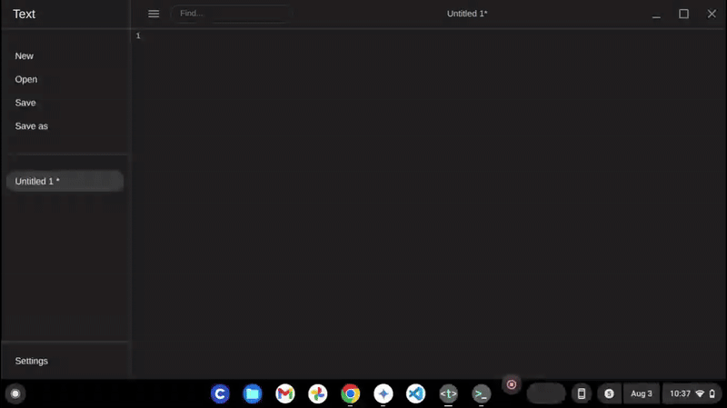

# Architect Project

This is a full-stack application featuring a React frontend and a Python FastAPI backend. Both services are containerized using Docker and deployed independently on Render, communicating via a REST API.

---
## Demo

*In the demo above, the React frontend makes a live API call to the Python backend to fetch and display project data.*

---
## Technologies Used
-   **Frontend:** React, Vite
-   **Backend:** Python, FastAPI, Uvicorn
-   **Deployment:** Git, Docker, Render

---
## Live Links
-   **Frontend:** `https://architect-frontend.onrender.com`
-   **Backend API:** `https://architect-backend.onrender.com/api/projects`
